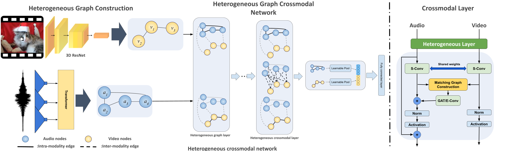

# Crossmodal Graph Learning for Acoustic Event Classification

<br>

**Sep 26, 2022**
* First release of the project.

<br>


In this project, we employ and end-to-end heterogeneous graphs to explicitly capture the spatial and temporal relationships between the modalities and represent detailed information of the underlying signal. Using heterogeneous graph approaches to address the task of visually-aware acoustic event classification, which serves as a compact, efficient and scalable way to represent data in the form of graphs. Through heterogeneous graphs, we show efficiently modeling of intra- and inter-modality relationships both at spatial and temporal scales. Our model can easily be adapted to different scales of events through relevant hyperparameters.
## Dependency installation

The code was successfully built and run with these versions:

```
pytorch-gpu 1.12.0
torchvision 0.13.1
torchaudio 0.12.0
cudatoolkit 11.3.1
pytorch_geometric 2.1.0.post1
torch-scatter 2.0.9
torch-sparse 0.6.15
torch-cluster 1.6.0
torch-spline-conv 1.2.1
opencv 4.6.0.66
scikit-learn 1.0.2

```
-You have to install ffmpeg 4.2 and build torchvision from source. You can find the instructions [here](https://github.com/pytorch/vision/blob/main/CONTRIBUTING.md#development-installation).

-Note: You can also create the environment I've tested with by importing _environment.yml_ to conda.

-Note: To enable gpu supprot for Pytorch-Geometric, you have to set ```export LD_LIBRARY_PATH="/home/amir_shirian/anaconda3/envs/end2endHeterGraph/lib:$LD_LIBRARY_PATH"```


<br>

## Preprocessing Data

The AudioSet dataset is downloaded using this [repository](https://github.com/AmirSh15/AudioSet_downloader). 

```
/data/
  AudioSet/
    train/
        Output_clip_len_0.25_audio_101/
            A capella/
                video_952_start_50_end_60.mp4
                ...
            Accelerating, revving, vroom/
            ...
    eval/
        Output_clip_len_0.25_audio_101/
            A capella/
                video_213_start_30_end_40.mp4
                ...
            Accelerating, revving, vroom/
            ...
```


<br>

## Training

This code is written using [detectron2](https://github.com/facebookresearch/detectron2). You can train the model with running main.py . 
You can config the model and training parameters in _configs/AudioSey.yaml_.

```
MODEL:
  META_ARCHITECTURE: "EndToEndHeteroGNN"
  AUDIO_BACKBONE:
    NAME: "WAV2VEC2_BASE"
    PRETRAINED_ON: ""
    FINETUNE: True
  VIDEO_BACKBONE:
    NAME: "r3d_18"
    PRETRAINED_ON: ""
    FINETUNE: True
  HIDDEN_CHANNELS: 512
  NUM_LAYERS: 4
TRAINING:
  LOSS: "CrossEntropyLoss"
  TRAIN_PLOT_PERIOD: 100
  L2_REGULARIZATION: False
  LABEL_SMOOTHING: 0.3
  CLASS_WEIGHTS: True
  NON_LINEAR_ACTIVATION: ""
GRAPH:
  DYNAMIC: False
  SPAN_OVER_TIME_AUDIO: 2
  AUDIO_DILATION: 1
  SPAN_OVER_TIME_VIDEO: 1
  VIDEO_DILATION: 1
  SPAN_OVER_TIME_BETWEEN: 2
  NORMALIZE: True
  SELF_LOOPS: False
  RESIDUAL: True
  ADJACENCY_DROPOUT: 0.2
  GRAPH_DROPOUT: 0.2
  FUSION_LAYERS: [-1]
  DISTANCE: "cosine"
  NUM_VIDEO_NODES: 10
  VIDEO_SEGMENT_LENGTH: 1000
  NUM_AUDIO_NODES: 20
  AUDIO_SEGMENT_LENGTH: 480
DATASETS:
  TRAIN_RATIO: 0.7
  EVAL_RATIO: 0.1
  TEST_RATIO: 0.2
  TRAIN_PATH: "Cross_modality_graph/data/AudioSet/train"
  TEST_PATH: "Cross_modality_graph/data/AudioSet/eval"
TEST:
  MAX_PATIENCE: 3
  EVAL_PERIOD: 2500
DATALOADER:
  BATCH_SIZE: 2
  STRATIFIED_SPLIT: True
  NUM_WORKERS: 6
SOLVER:
  OPTIM: "Adam"
  BASE_LR: 0.0005
# consider same learning rate for both audio, video and graph if True else will have 1/10 of the base learning rate for audio and video models
  SAME_LR: False
# learning rate scheduler (options: "CosineAnnealingLR", "CosineAnnealingWarmRestarts", "WarmupMultiStepLR)
  LR_SCHEDULER_NAME: "CosineAnnealingWarmRestarts"
# parameters for CosineAnnealingLR
  LR_SCHEDULER_T_MAX: 2500
# parameters for CosineAnnealingWarmRestarts
  LR_SCHEDULER_T_MULT: 2
# parameters for WarmupMultiStepLR
  WARMUP_ITERS: 1000
#  Steps for decreasing lr for 1/10. The way you set: (1500,)
  STEPS: ()
  MAX_ITER: 100000
# number of epochs to be accumulated before updating the parameters
  ITERS_TO_ACCUMULATE: 2
# option to enable 16-bit training
  AMP:
    ENABLED: False
  MY_CLIP_GRADIENTS:
    ENABLED: True
  CLIP_GRADIENTS:
    CLIP_VALUE: 1.0
INPUT:
  MIN_SIZE_TRAIN: (640, 672, 704, 736, 768, 800)
VERSION: 0
SEED: 1
WANDB:
  PROJECT_NAME: "CrossModalGraph"
  ENABLED: True
  CONFIG_PATH: "configs/wandb_config.yaml"
  PERIOD: 100
```

<br>

## Reference 
If you found this repo useful give me a star!

[//]: # ([ArXiv's paper]&#40;https://arxiv.org/pdf/2008.02063&#41;)
```
@inproceedings{shirian2022visually,
  title={Visually-aware Acoustic Event Detection using Heterogeneous Graphs},
  author={Shirian, Amir, Somandepalli, Krishna, Sanchez, Victor,  and Guha, Tanaya},
  booktitle={Proc. Interspeech 2022},
  year={2022}
}
```


<br><br><br>
